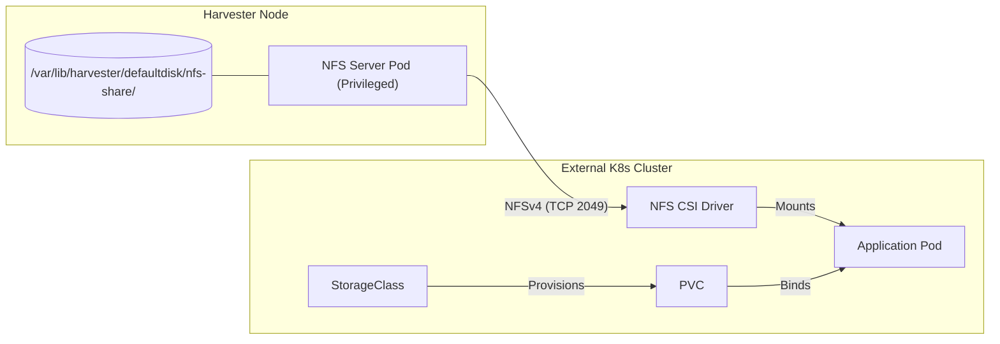

# NFS Server on SLE BCI (Harvester Compatible)

This project provides a containerized NFS Server built on **SUSE Linux Enterprise Server (SLES) 16.0 Base Container Images (BCI)**. 

It is designed to deploy a persistent NFS server on immutable infrastructure like **Harvester** or **SLE Micro**, allowing you to serve local host storage to external Kubernetes clusters via the **NFS CSI Driver**.

You will get a storage provider for ReadWriteMany PVCs with Volume Expansion using the main server disk on a Harvester node without needing to install anything on the system itself (not that can do that so easily since it's a read-only system...)

## ❓But... why?

I needed a ReadWriteMany storage provider for some tests in my lab, and didn't want to map the NFS off of my NAS, which is veeery slow as it's on the other side of the network. So, why not use that juicy disk space already allocated to one of very fast disks on the Harvester hosts? 

It might be completely unsupported in a production environment, so please be careful when using this, okay? 😼

## 🏗 Architecture



## ⚙️ Configuration Options

| Env Variable | Default | Description |
| --- | --- | --- |
| `SHARED_DIRECTORY` | `/` | The internal path to export. |
| `ALLOWED_CLIENTS` | `*` | IP or Subnet allowed to connect (e.g., `10.42.0.0/16`). |

## 🚀 Quick Start

### 1. Build

```bash
cd src
# Build locally
./build.sh

```

### 2. Local Testing (Podman)

**⚠️ Important:** Because this container uses the Kernel NFS Server, it **must** be run with `sudo` (privileged) and cannot run rootless.

```bash
# Must use sudo
sudo podman run --rm -it \
  --privileged \
  --net=host \
  -e SHARED_DIRECTORY=/data \
  -e ALLOWED_CLIENTS="127.0.0.1" \
  localhost/nfs-server-bci:local-test

```

### 3. Deploy to Harvester

1. Update `kubernetes/nfs-server-deployment.yaml` with your node name and image registry.
2. Apply the deployment:
```bash
kubectl apply -f kubernetes/nfs-server-deployment.yaml

```
**⚠️ Important:** Remember to create the directory at /var/lib/harvester/defaultdisk/nfs-share MANUALLY! The default SELinux policy in RKE2 won't allow DirectoryOrCreate to succeed from the container!

### 4. Connect External Cluster

1. Install the **NFS CSI Driver** on your client cluster.
2. Apply the StorageClass pointing to your Harvester Node IP:
```bash
kubectl apply -f kubernetes/dynamic-nfs-storageclass.yaml

```

**⚠️ Important:** Look at the deployment logs to get the server IP and parameters to configure on your StorageClass! Example:
```bash
kubectl logs -n default -l app=nfs-server-bci
```


3. Create PVCs normally.

## 🔧 Troubleshooting

* **"Permission denied" on build/run:** Ensure you are using `sudo` for `podman run`.
* **"Unsupported version":** SLES 16 (ALP) has removed NFSv2. This image is configured for v3/v4 only.
* **Mount errors:** Ensure `securityContext.privileged: true` is set in your Kubernetes deployment.

